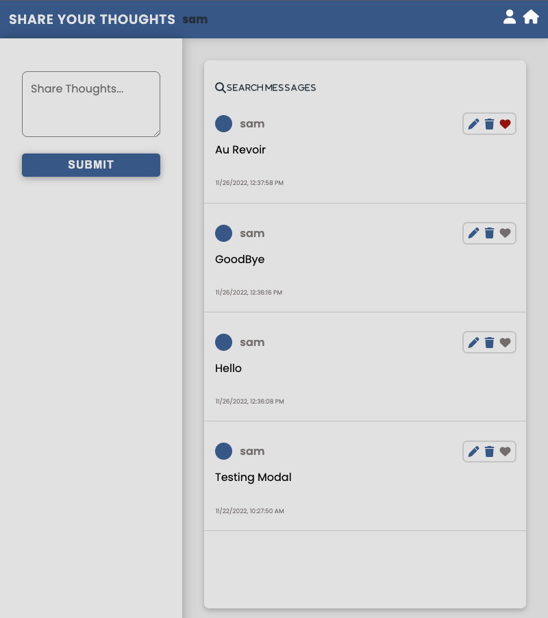
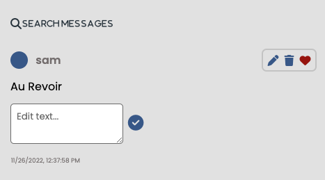
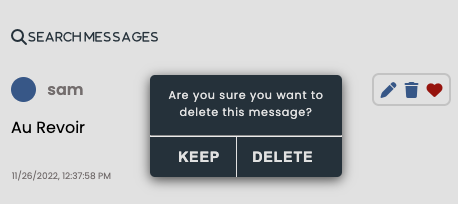
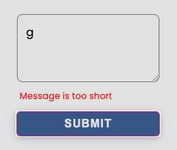
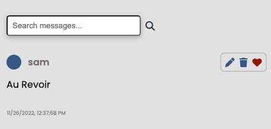

## Share Your Thoughts

A full stack web application using NEXTJS and MYSQL. A messaging app that allows for user sign up. Each user is giving a page to add and save messages. Built with JavaScript, React, React hooks, SWR, and CSS.

## Project Status

Nov 10 - Connected the NextJS app with MySQL database. Formik library linked to database

Nov 14 - Dynamic routes for each user

Nov 21 - Created a edit and delete feature for both the UI and in the database

Nov 23 - Filter through messages using a search input field

DECEMBER

- Installed Next Auth, Prisma

Dec 15 - Restarted the project to include typescript and tailwind. 
         UseContext for the site's dark mode

Dec 24 - REworked the site's UI with Tailwind
## Project Screen Shot(s)

## Installation and Setup Instructions

Clone down this repository. You will need `node` and `npm` installed globally on your machine.

Installation:

`npm install`

To Start Server:

`npm run dev`

To Visit App:

`localhost:3000/user`

## Reflection

- What was the context for this project?
  - To learn and practice developing a fullstack application in NextJs.
- What did you set out to build?

  - A full stack CRUD application,

- Why was this project challenging and therefore a really good learning experience?
  - As a developer, it's is important to understand how an entire web application flows.
- What were some unexpected obstacles?
  - The favorites feature and persisting the data in localstorage
- What tools did you use to implement this project?
  - NEXTJS, React, SWR, Formik, MySQL, Sql, Git, Github, VS Code
